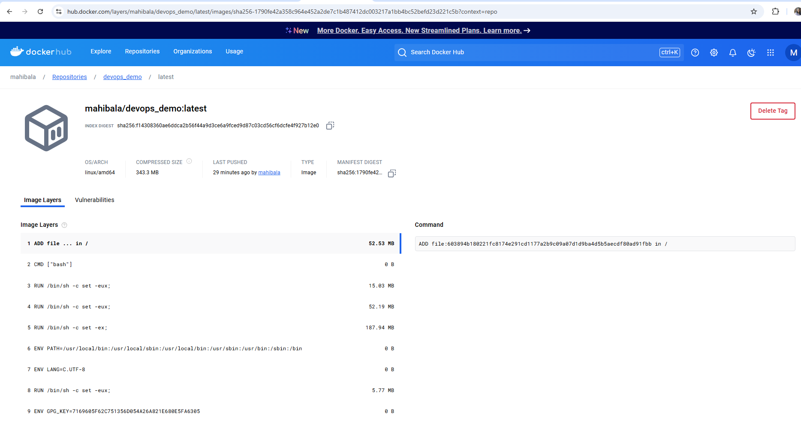
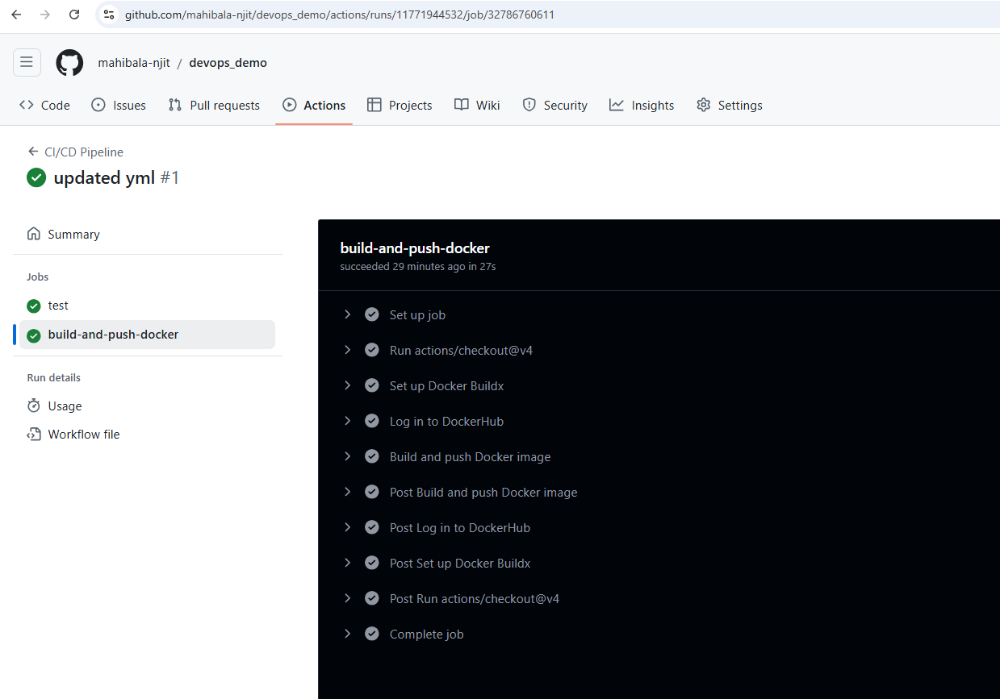

# Devops - Automated Builds Pushing to Dockeruhub Intro

For this assignment I want you to watch the following two videos and create your own GitHub Repo from scratch based on this repository.   You will learn to setup a GitHub Action to implement a CI/CD workflow to automaticly test, build and push your program's image to Dockerhub.  Add screen shots to this readme file where indicated that show the image published in your Docker hub account. 

## Screenshots

1. Put the screenshot of your image in your Docker account here.

2. Latest github workflow run

https://github.com/mahibala-njit/devops_demo/actions/runs/11771944532/job/32786760611

